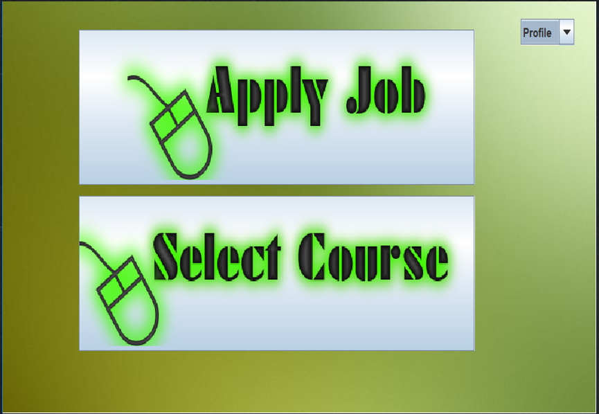

# Job-and-Course-Proposer

## Introduction

Job and Course Proposer is an application that’ll help the newly joined university fresher’s and fresh graduates. A list of courses are provided that’ll help students to increase their skill in that particular field and a list of jobs are provided with necessary requirements that both graduate and undergraduate students can avail if they meet the required requirements by forwarding their CV to them.

## User Category

There are two types of Users in this application they are:

<ul>
  <li>Admin</li>
	<li>User</li>
</ul>

## Feature List

In this project the Admin has the following features

<ul>
  <li>Manages members</li>
	<li>Grants/ deny access to member</li>
  <li>Manage users and admins right</li>
  <li>Manages users access to virtual spaces</li>
  <li>Blocks user</li>
  <li>Forwards response to user</li>
</ul>

In this project the User has the following features

<ul>
  <li>Push notifications</li>
  <li>Mobile payment</li>
  <li>Security</li>
  <li>Feedback system</li>
  <li>Reliability</li>
  <li>Speed<li>
</ul>

## GUI Description

Author’s operating page

Author can both add or drop any user/ course/job

Author of this application can add any courses/ jobs by entering new data with different id for each insertion using interface like this

user can select his/her preference

All the enrolled courses by a particular user

All jobs available result from database  Details about Job     

## Er Diagram

## Database Table Description
### company

### enrolled

### courses

### enrolled

### user

## Class Diagram

## Use Case Diagram

## System Architecture

## Statechart Diagram

## Tool Used

To develop this project we have used the following

<ul>
  <li>Netbeans</li>
  <li>Xampp</li>
  <li>Drag and Drop</li>
  <li>JDBC Connector</li>
</ul>

## OOP and Java Concepts Used
<ul>
  <li>Concept 1: Inheritance</li>
  <li>Concept 2: Interface</li>
  <li>Concept 3: Exception handling</li>
  <li>Concept 4: Graphical User Interface</li>
  <li>Concept 5: Java Database Connectivity</li>
  <li>Concept 6: Events</li>
</ul>

## Impact of this Project

The main motive behind this project is to help the fresher’s who are interested in CS but due to having lack of knowledge and importance of today’s tech world they are lacking behind skills and get rejected in jobs for not having the requirements they’re asked for. By the help of this application both fresher and a fresh graduate or other individual can acquire knowledge help build their skills and can prepare themselves for their desired job.

## Limitations

Lists of limitation in this application are

<ul>
  <li>Internet reliance</li>
  <li>Usage situation</li>
  <li>Inaccurate clicks</li>
  <li>Amount of storage</li>
  <li>Size of screen</li>
</ul>

## Possible Future Improvements

Lists of possible future improvements in this application are:

<ul>
  <li>Geo location</li>
  <li>Events on Programming contests</li>
  <li>Adding more courses</li>
  <li>Adding tutorial links on the available courses</li>
  <li>Providing course description and its advantages</li>
  <li>User friendly</li>
  <li>Suggesting requirement based courses </li>
  <li>Goals reminder</li>
</ul>
